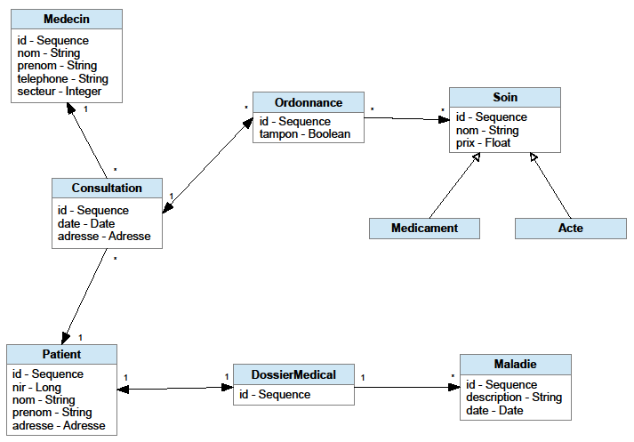

 # Java Persistence 
 # Query Langage (JPQL) 

--
# Stratégie de chargement : JPQL

 * La configuration au niveau du mapping offre peu de possibilité 

 * Besoin d’une méthode plus souple\, et permettant de composer des requêtes plus poussées 

 * 2 possibilités : JPQL ou Criteria 

--
# Le JPQL

 * JPQL : Il s'agit d'une syntaxe proche du SQL 

 * La syntaxe fait référence aux entités Java mappées avec JPA\, au lieu des tables et colonnes du SQL 

 * Permets de réaliser des requêtes de chargement complexe avec des critères 

--
# Le JPQL

 * On peut réaliser quasiment tous les types de requêtes correspondant au SQL 

 * Certaines restrictions peuvent concerner les UPDATEs\, les INSERTs massifs\, les DELETEs 

 * De nombreuses fonction du SQL sont disponibles (consulter la doc) 

 * Attention :     Faire des requêtes simples autant que possible (conseil perso) 

 * Conseil : Select avec jointure explicite (JOIN\, LEFT JOIN)\, éviter les sous\-requêtes… 

--
# Conseil d'utilisation du JPQL

 * Tant que les volumes restent relativement faibles (performances acceptables) 

 * SELECT : Utiliser le JPQL pour récupérer les données (peu/pas de LazyLoading) 

 * UPDATE : Faire les modifications sur les objets Java via les setters 

 * INSERT\, DELETE :Insérer ou supprimer via l'EntityManager (entityManager\.persist()\, entityManager\.remove()) 

--
# JPQL : Synthaxe SELECT

*  Toutes les Table/Entité doivent avoir un alias 
    *  Ex :     SELECT med FROM Medecin med 
    *  (on omet le AS du SQL) 
*  On parcourt le graphe objet avec le point (\.) en faisant référence aux attributs dans la classe 
    *  Ex :      SELECT med FROM Medecin med 
        *  WHERE med\.nom IS NOT NULL 
*  Cette syntaxe est proche de l'OGNL de struts 
--
# JPQL : Les paramètres


* Attention : Ne pas concaténer les paramètres dans la requête (valable hors JPA) 
* →     <span style="color: red">Risque d'injection SQL</span>
* Il est conseillé de passer des paramètres aux requêtes avec un alias 
    *  Ex : 
    ```sql
    SELECT med FROM Medecin med WHERE med.nom = :paramNom
    ```
*  On renseigne les paramètres ensuite dans l'objet Query (équivalent JPA du PrepareStatement) 
--
# JPQL : Création des requêtes

*  La création de la requête se fait via l'EntityManager : 
    *  entityManager    \.createQuery(requeteHql\, TypeRetour\.class) 
*  2 objets possibles : 
    *  Query : Sans type retour défini 
    *  TypedQuery : avec type retour (conseillé) 

--
# JPQL : Création des requêtes

*  On renseigne les paramètres : 
    *  query    \.setParameter(    ''paramNom''    \,         nom    ) 
*  Utile : le paramètre peut être un objet ou un tableau (pour les clauses IN) 
    * query    \.setParameter(    ''uniteLegale''    \,         uniteLegale    ) 
    * query    \.setParameter(    ''listSiren''    \,         sirens    ) 

--
# JPQL : Récupération des résultats

*  Une fois la requête constituée et les paramètres éventuels renseignés 
*  On peut récupérer les résultats de plusieurs manières : 
    *  query    \.getResultList()     (renvoie une liste d’objets) 
    *  query    \.getSingleResult()     (attends un résultat unique sinon → <span style="color: red">NonUniqueResultException</span> ) 
    *  query    \.getResultStream()     (résultat sous forme de Stream) 

--
# Utilité du Stream

* `getResultList()` et `getSingleResult()` récupère la totalité du ResulSet en une opération 
*  Peut être problématique en cas de volume de données important
* -> Risque de surcharge du réseau 

--
# Utilité du Stream

*  `getResultStream()` permet d’utiliser la logique Stream 
*  Déclenche la création d’un curseur si cette techno est disponible (dépends du SGBD) 
*  Permet la récupération des données par « paquets » → meilleures performances sur un grand nombre d’objets

--
# JPQL : Les jointures

*  On peut faire tous les types de jointures : 
    *  Interne :  
    ```sql
    SELECT med FROM Medecin med JOIN med.patients patient
    ```
    *  Externe :
    ```sql
    SELECT med FROM Medecin med LEFT JOIN med.patients patient
    ```
    *  Cartésienne (dites Cross\-Join)(    A éviter \!\!\!    ) : 
    ```sql
    SELECT med FROM Medecin med, Patient patient 
    WHERE patient.medecin = med
    ```
--
# JPQL : Les jointures

*  Hibernate\, d'après le mapping     déduira les colonnes à utiliser pour effectuer les jointures (clef étrangère, id etc.) 
*  Il est préférable d'éviter les jointures cartésiennes, car peu performantes (vrai hors JPA) 
*  On peut ensuite ajouter des critères sur les patients : 
```sql
SELECT med FROM Medecin med 
JOIN med.patients patient 
WHERE patient.nom = :paramNomPatient 
```

--

*  On peut faire tous les types de jointures : 
    *  Interne :      SELECT med FROM Medecin med 
    *                         JOIN med\.patients patient 
    *  Externe :     SELECT med FROM Medecin med 
    *                        LEFT     JOIN med\.patients patient 
    *  Cartésienne (dites Cross\-Join) : 
    *          SELECT med FROM Medecin med\, Patient patient 
    *                 WHERE patient\.medecin = med 
*  Hibernate\, d'après le mapping     déduira les colonnes à utiliser pour effectuer les jointures (clef étrangère) 
*  Il est préférable d'    éviter les jointures cartésiennes    \, car elles sont moins rapides en général 
*  On peut ensuite ajouter des critères sur les patients : 
    *  SELECT med FROM Medecin med JOIN med\.patients patient 
    *                 WHERE patient\.nom = :paramNomPatient 


* SELECT \* FROM medecin

 * INNER JOIN    patient ON patient\.id\medecin = medecin\.id

--


*  On peut faire tous les types de jointures : 
    *  Interne :      SELECT med FROM Medecin med 
    *                         JOIN med\.patients patient 
    *  Externe :     SELECT med FROM Medecin med 
    *                        LEFT     JOIN med\.patients patient 
    *  Cartésienne (dites Cross\-Join) : 
    *          SELECT med FROM Medecin med\, Patient patient 
    *                 WHERE patient\.medecin = med 
*  Hibernate\, d'après le mapping     déduira les colonnes à utiliser pour effectuer les jointures (clef étrangère) 
*  Il est préférable d'    éviter les jointures cartésiennes    \, car elles sont moins rapides en général 
*  On peut ensuite ajouter des critères sur les patients : 
    *  SELECT med FROM Medecin med JOIN med\.patients patient 
    *                 WHERE patient\.nom = :paramNomPatient 


* SELECT \* FROM medecin

 * INNER JOIN    patient ON patient\.id\medecin = medecin\.id

* SELECT \* FROM medecin

 * LEFT JOIN    patient ON patient\.id\medecin = medecin\.id

--


*  On peut faire tous les types de jointures : 
    *  Interne :      SELECT med FROM Medecin med 
    *                         JOIN med\.patients patient 
    *  Externe :     SELECT med FROM Medecin med 
    *                        LEFT     JOIN med\.patients patient 
    *  Cartésienne (dites Cross\-Join) : 
    *          SELECT med FROM Medecin med\, Patient patient 
    *                 WHERE patient\.medecin = med 
*  Hibernate\, d'après le mapping     déduira les colonnes à utiliser pour effectuer les jointures (clef étrangère) 
*  Il est préférable d'    éviter les jointures cartésiennes    \, car elles sont moins rapides en général 
*  On peut ensuite ajouter des critères sur les patients : 
    *  SELECT med FROM Medecin med JOIN med\.patients patient 
    *                 WHERE patient\.nom = :paramNomPatient 


* SELECT \* FROM medecin

 * INNER JOIN    patient ON patient\.id\medecin = medecin\.id

* SELECT \* FROM medecin

 * LEFT JOIN    patient ON patient\.id\medecin = medecin\.id

* SELECT \* FROM    medecin\, patient 

* WHERE patient\.id\medecin = medecin\.id

--
# JPQL : Chargement des associations

 * On voit donc le besoin des liens objets pour pouvoir parcourir le graphe 

 * →     cf\. Besoin d’un modèle objet « propre » 

 * On peut récupérer les objets avec leurs associations instanciées 

 * On peut récupèrer ainsi des « portions » du graphe objet : 

 * →     On élimine le problème du « Select N\+1 » 

 * Possible avec les jointures internes ou externes 

 * Utilisation du mot clef :     FETCH 

 * Attention :     Limite du nb de jointures si la Collection est une List :  

 * →     Privilélier les Set (cf partie sur les associations) 

--


*  Par exemple\, si on veut récupérer le Medecin avec ses Patient(s) instanciés : 
    *  SELECT med FROM Medecin med 
    *  JOIN     FETCH     med\.patients patient 
*  JPA retournera donc un objet Medecin\, dont l’attribut « patients » contient une collection d’objets Patient 
*  On peut aussi faire une jointure externe :  
    *  LEFT JOIN     FETCH     med\.patients…  
    *  (On aura alors aussi les médecins qui n'ont pas de patients) 
*  Sans le mot FETCH\, la requête contiendra bien la jointure\, mais la collection de patients restera vide 
*  Les jointures sans FETCH restent utiles pour appliquer des conditions         (ex\. diapo suivante) 
--


*  Comme on a vu\, on peut ajouter des critères sur les objets de l'association : 
    *             SELECT med FROM Medecin med 
    *            JOIN     FETCH     med\.patients patient 
    *  WHERE patient\.nom = :paramNomPatient 
*  On récupère alors un Medecin mais les patients instanciés sont seulement ceux qui vérifient les critères du WHERE 
*  Ici on aura les Medecin avec dans leurs collection de patients uniquement les patients dont le nom vaut     paramNomPatient 
*  L'objet est donc « incomplet » → Peut conduire à des erreurs 
*  Conseil : Si les objets liés sont relativement « peu nombreux »\, charger tous les objets liés et faire le tri en Java 
*  Ainsi l'objet est à l'image du contenu de la BDD 
--


 * Les requêtes sont analysées à l'exécution → Potentielles erreur sur le nom des classes ou attributs 

 * On peut utiliser @NamedEntityGraph  ou @NamedQuery pour stocker au niveau des entités les requêtes 

 * Elles sont alors analysées au démarrage du serveur 

 * Moins souple que JPQL puisque défini au sein du mapping 

--
 * On définit donc avec JPQL des portions de graphe qu'on va charger en 1 fois 

 * Il vaut mieux charger tout ce dont on a besoin en 1 fois… mais que ce dont on a besoin \! 

 * Cela peut conduire à des requêtes longues (nb caractères)\, mais le traitement est en général plus court 

 * N'hésitez pas à tester pour s'en assurer \! 

 * Attention :     Ne pas oublier les indexs sur les clefs étrangères pour Postgres \!\!\! 

--
 * Ex : Traitement concernant le dossier médical des patients d'un médecin 

* 

--
 * Ex : Traitement concernant le dossier médical des patients d'un médecin 

* 

--
 * Ex : Traitement concernant le dossier médical des patients d'un médecin 

* 

--
 * Ex : Traitement concernant le dossier médical des patients d'un médecin 

* 

--
 * Ex : Traitement concernant le dossier médical des patients d'un médecin 

* 

--


*  Ex : Traitement concernant le dossier médical des patients d'un médecin 
    *  SELECT med FROM Medecin med 
    *  JOIN FETCH med\.consultations consult 
    *  JOIN FETCH consult\.patient patient 
    *  JOIN FETCH patient\.dossierMedical dossier 
    *  WHERE med\.id = :paramId 
*  On récupère le médecin avec tous les objets liés nécessaires 
*  On ne doit avoir ensuite aucune requête générée au cours du traitement 
*  Les liens objets sont nécessaires au parcours → D'où la nécessité de les matérialiser (cf partie association) 
--
# JPQL : De nombreuses autres possibilités


*  Possibilités de faire des « projections » : 
    *  SELECT med\.nom\, med\.age FROM Medecin med 
*  getResultList() renvoie alors une List de tableau d'objet (List\<Object[]>) 
    *  Dans l'exemple : object[0] → nom\, object[1] → age 
*  Conseil : Travailler autant que possible avec des objets complets 
*  Utile en cas de problème de performance  dû à de trop nombreuses colonnes 
--


*  Fonctions d'agrégation disponibles : 
    *  COUNT\, AVG\, MIN\, MAX\, SUM 
*  Possibilité de faire des     GROUP BY     et     ORDER BY 
*  Fonction chaîne de caractère : 
    *  CONCAT\, SUBSTRING\, UPPER\, LENGTH…  
*  Fonction mathématique : 
    *  ABS\, MOD\, SQRT …  
*  Fonction date : 
    *  CURRENT\DATE/TIME/TIMESTAMP 
    *  YEAR\, MONTH\, DAY …     (propres à Hibernate) 
*  Liste complète dans la doc 
*  Conseil perso : Sauf besoin particulier (ex\. tableau de bord)\, se limiter plutôt à des requêtes simples et faire les traitements en Java 
--
# TP 7 : Requête de chargement complexe

 * Ecrire le contenu de la méthode     findByCodeNafWithEntreprisesAndDeclarationAndIndicesJPQL         dans     SecteurDaoImpl     permettant de  récupérer un secteur avec ses entreprises et leurs déclarations 

 * L    ancer le test     SecteurServicesPerformancesTestJPQL 

 * Observer les requêtes générées ave    c     show\sql=true 

 * Examiner le code du test et la méthode pour vérifier qu’il n’y a qu’une requête générée 

* 

--
 * L’API Criteria 

--
# L'API Criteria

 * JPA propose une autre manière de réaliser des requêtes complexes 

 * Criteria est une API qui permet de construire des requêtes à partir d'objets Java 

 * Criteria permet de rendre les requêtes « Type\-Safe »\, ie fortement typée 

 * Criteria permet de créer des requêtes dynamiques (ajout de clause selon le contexte par ex) 

 * Mais requêtes moins lisibles\, construction un peu plus complexe 

 * Plusieurs utilisations sont possibles… 

--
# L'API Criteria : Des requêtes fortement typées

 * On a vu avec JPQL\, que les requêtes étaient des chaînes de caractère 

 * Mais que se passe\-t\-il si un attribut\, ou une classe change de nom ?… 

 * Il faut modifier toutes les requêtes qui y font référence \! 

 * Pas d'erreurs de compilation → Couverture par les tests obligatoire ou risque de plantage en prod \!\!\! 

 * L'API Criteria permet d'avoir un lien direct\, organique\, entre les requêtes et les objets sur lesquels elles portent 

 * De même : Comment ajouter proprement des conditions aux requêtes selon le contexte sans manipuler des String ?  

     →     Criteria permet la création de requêtes via la manipulation          d’objets 

--
 * CriteriaBuilder     builder     =     entityManager    \.getCriteriaBuilder(); 

* On crée l'objet qui va nous

* permettre de construire la 

* requête

--
 * CriteriaBuilder     builder     =     entityManager    \.getCriteriaBuilder(); 

 * CriteriaQuery\<Secteur>     criteria     =                     builder    \.createQuery( Secteur\.    class     ); 

* On crée la requête

* en indiquant le type retour

--
 * CriteriaBuilder     builder     =     entityManager    \.getCriteriaBuilder(); 

 * CriteriaQuery\<Secteur>     criteria     =     	    	    	    builder    \.createQuery( Secteur\.    class     ); 

 * Root\<Secteur>     root     =     criteria    \.from( Secteur\.    class     ); 

* On indique l'entité de laquelle

* on part (correspond à ce qui

* suit FROM)

--
 * CriteriaBuilder     builder     =     entityManager    \.getCriteriaBuilder(); 

 * CriteriaQuery\<Secteur>     criteria     =     	    	    	    builder    \.createQuery( Secteur\.    class     ); 

 * Root\<Secteur>     root     =     criteria    \.from( Secteur\.    class     ); 

 * criteria    \.select(     root     ); 

* On indique le type de

* requête (SELECT\, UPDATE…)

--
 * CriteriaBuilder     builder     =     entityManager    \.getCriteriaBuilder(); 

 * CriteriaQuery\<Secteur>     criteria     =     	    	    	    builder    \.createQuery( Secteur\.    class     ); 

 * Root\<Secteur>     root     =     criteria    \.from( Secteur\.    class     ); 

 * criteria    \.select(     root     ); 

 * criteria    \.where(     builder    \.equal(     root    \.get(     "codeNaf"     )\,     codeNaf     ) ); 

* On ajoute des critères (correspond

* à la clause WHERE)

--
 * CriteriaBuilder     builder     =     entityManager    \.getCriteriaBuilder(); 

 * CriteriaQuery\<Secteur>     criteria     =     	    	    	    builder    \.createQuery( Secteur\.    class     ); 

 * Root\<Secteur>     root     =     criteria    \.from( Secteur\.    class     ); 

 * criteria    \.select(     root     ); 

 * criteria    \.where(     builder    \.equal(     root    \.get(     "codeNaf"     )\,     codeNaf     ) ); 

 * List\<Secteur>     secteurs     =                  e    ntityManager    \.createQuery(     criteria     )\.getResultList(); 

* On récupère le résultat

--
 * CriteriaBuilder     builder     =     entityManager    \.getCriteriaBuilder(); 

 * CriteriaQuery\<Secteur>     criteria     =     	    	    	    builder    \.createQuery( Secteur\.    class     ); 

 * Root\<Secteur>     root     =     criteria    \.from( Secteur\.    class     ); 

 * criteria    \.select(     root     ); 

 * criteria    \.where(     builder    \.equal(     root    \.get(     "codeNaf"     )\,     codeNaf     ) ); 

 * List\<Secteur>     secteurs     =                  e    ntityManager    \.createQuery(     criteria     )\.getResultList(); 


*  Equivalent JPQL : 
  *  SELECT secteur FROM Secteur 
  *  WHERE codeNaf = :paramCodeNaf 
--


 * Ainsi si la classe Secteur devient SecteurNaf\, la requête reste valide 

 * On voit qu’on pourrait ajouter ou enlever des conditions au WHERE programmatiquement 

 * Utile pour les tableaux avec filtres dynamiques 

 * En revanche il reste les attributs (dans les critères)\, qui restent non\-typés : 

               criteria    \.where(     builder    \.equal(     root    \.get(     "codeNaf"     )\,     codeNaf     ) ); 

 * Il est possible d'utiliser le « JPA Metamodel Generator » 

 * Permets de générer des classes qui sont l'image du mapping\, et d'y faire référence dans les requêtes Criteria 

--
# L'API Criteria : JPA Metamodel Generator

 * Classes générées par JPA Metamodel Generator : 

 * @Generated    (value =     "org\.hibernate\.jpamodelgen\.JPAMetaModelEntityProcessor"    ) 

 * @StaticMetamodel    (Secteur\.    class    ) 

 * public         abstract         class     Secteur\ \{ 

       public         static         volatile     SetAttribute\<Secteur\, Indice>     indices    ; 

       public         static         volatile     SingularAttribute\<Secteur\, String>         libelleNomenclature    ; 

       public         static         volatile     SingularAttribute\<Secteur\, String>     codeNaf    ; 

       public         static         volatile     SetAttribute\<Secteur\, Entreprise>     entreprises    ; 

       public         static         volatile     SingularAttribute\<Secteur\, Integer>     id    ; 

 * \} 

--
# L'API Criteria : Des requêtes fortement typées

 * Les attributs des classes générées sont statiques 

 * On peut donc dans les requêtes faire référence aux attributs en tant qu'objet  : 

         criteria    \.where(     builder    \.equal(     root    \.get( Secteur\\.    codeNaf     )\,     codeNaf     ) ); 

 * On arrive donc à des requêtes entièrement typées 

 * Pour générer les classes du métamodèle\, un peu de config Maven \+ plugin Eclipse « m2e » 

 * Les classes générées se mettent à jour automatiquement lorsque les entités évoluent 

--
# L'API Criteria : Conclusion

 * L'API Criteria permet d'avoir des requêtes totalement typées 

 * Assez utile pour générer des requêtes dynamiques qui s’adaptent au contexte (tableau avec filtres optionnels) 

 * Difficulté réside dans son appropriation\, et son manque de lisibilité 

 * Conseil : Si utilisation de Criteria\, alors utilisation complète     avec Métamodel 

--
# TP 8 : Requête de chargement complexe avec Criteria

 * Réaliser une méthode de récupération d'un secteur avec ses entreprises et leur déclaration avec l'API Criteria 

 * Lancer le test qui vérifie qu'il n'y a qu'une     requête (    SecteurServicesPerformancesTestCriteria    ) 

 * Observer les requêtes générées avec     show\sql=true 

* 

--
 * Configuration 

 * d’Hibernate 

--
# La configuration de JPA/Hibernate

 * La configuration s'est simplifiée avec les nouvelles versions 

 * Un seul fichier optionnel : persistence\.xml 

 * Normalement dans le répertoire META\-INF 

 * Normalement\, on y déclare les infos pour la connexion (url\, username\, password… ) 

 * Sauf que\, comme on utilise InseeConfig\, ou Spring\, pour les properties\, on y déclare souvent le strict minimum… ou rien du tout 

--
 * Exemple : 

 * Seule info : le nom de l'unité de persistence 

 * Unité de persistence : Objet correspondant conceptuellement à une source de données 

 * Plusieurs unités de persistence possibles si plusieurs BDD par ex\. (rare normalement) 

	  <persistence\-unit name="   persistenceUnit   ">

	  	  \<description>

                       Persistence unit pour formation Hibernate 5

                \</description>

	  \</persistence\-unit>

--


*  JPA utilise essentiellement 2 composants : 
    *  EntityManagerFactory : 1 EntityManagerFactory est créé par unité de persistence\, au démarrage du serveur (ou du batch) 
    *  EntityManager : on l'a déjà utilisé\, est créé par le composant précédent\, en général 1 par transaction 
*  L'EntityManagerFactory contient les métadonnées sur le mapping des objets 
*  EntityManagerFactory\, objet de plus haut niveau\, plus long à créer 
*  On manipule plus souvent directement l'EntityManager 
*  L’EntityManager est créé de manière transparente à l’ouverture d’une transaction 
--


 * Lorsqu'on utilise Spring\-Boot ou InseeConfig (qui utilise Spring)\, on préfère passer les infos de connexions via Spring 

 * On crée donc souvent l'EntityManagerFactory dans les fichiers Spring 

 * Avec Spring\-Boot la création de     l'EntityManagerFactory est transparente 

 * On rencontre à l'Insee 2 types de config le plus souvent 

--
# Configuration avec InseeConfig ou equivalent

 * On créé l'EntityManagerFactory en donnant en paramètre directement le Pool de connexion créé par InseeConfig (ou SD44Configuration) 

 * Problème : Besoin d'accéder parfois à la DataSource\, ie l'objet auquel est rattaché le pool de connexion 

 * Par exemple pour logger les requêtes     avec les paramètres    \, et pour avoir un compteur de requêtes (cf TP7 et 8) 

 * On veut pouvoir accéder à la DataSource pour la « wrapper » 

--
# Configuration avec InseeConfig

 * Alternative : Récupérer la DataSource depuis InseeConfig\, et créer l'EntityManagerFactory avec\. Ex : 

* \<bean id="dataSource" class="fr\.insee\.config\.InseeConfig" factory\-method="getPool">

	  \<constructor\-arg type="String">

	  	  \<value>   hibernate5   \</value>

	  \</constructor\-arg>

* \</bean>

 * Ici\, nom du pool de connexion choisi 

--
 * Alternative : Récupérer la DataSource depuis InseeConfig …  

* \<bean id="dataSource" class="fr\.insee\.config\.InseeConfig" factory\-method="getPool">

	  \<constructor\-arg type="String">

	  	  \<value>hibernate5\</value>

	  \</constructor\-arg>

* \</bean>

 * Correspond à… 

 * (fonctionnement d'InseeConfig) 

* fr\.insee\.database\.   hibernate5   \.username=postgres

* fr\.insee\.database\.   hibernate5   \.password=

* fr\.insee\.database\.   hibernate5   \.url=jdbc:postgresql://localhost:5432/di\pg\hib5\locale

* fr\.insee\.database\.   hibernate5   \.driverClassName=org\.postgresql\.Driver

--
 * …     Et créer l'EntityManagerFactory avec : 

* \<bean id="myEmf" class="org\.springframework\.orm\.jpa\.LocalContainerEntityManagerFactoryBean">

	  \<property name="jpaVendorAdapter">

	  	  \<bean class="org\.springframework\.orm\.jpa\.vendor\.HibernateJpaVendorAdapter" />

	  \</property>

 	    \<property name="dataSource" ref="dataSource" /> 

	  \<property name="jpaProperties">

	  	  \<props>

	  	  	  \<prop key="hibernate\.default\schema">$\{fr\.insee\.formation\.hibernate5\.schema\}\</prop>

	  	  	  \<\!\-\- generate ddl \-\->

	  	  	  \<prop key="javax\.persistence\.schema\-generation\.database\.action">drop\-and\-create\</prop>

	  	  	  \<\!\-\- dialect \-\->

	  	  	  \<prop key="hibernate\.dialect">org\.hibernate\.dialect\.PostgreSQLDialect\</prop>

	  	  	  \<prop key="hibernate\.connection\.useUnicode">true\</prop>

	  	  	  \<prop key="hibernate\.connection\.charSet">UTF\-8\</prop>

	  	  	  \<\!\-\- logging debug information \-\->

	  	  	  \<prop key="hibernate\.show\sql">true\</prop>

	  	  	  \<prop key="hibernate\.format\sql">true\</prop>

	  	  	  …   (   De nombreuses autres propriétés disponibles\, voir dans la doc) 

	  	  \</props>

	  \</property>

* \</bean>

--
# Configuration avec Spring-Boot

 * Spring\-Boot permet de disposer d’une configuration JPA/Hibernate avec très peu de code 

 * Il suffit d’ajouter le starter « data\-jpa » au pom 

 * O    n renseigne ensuite la chaîne     spring\.datasource\.url      

 * Spring\-Boot en déduit alors le type de base données et met en place tous les composants nécessaires 

 * Spring\-Boot met en place un pool de connexion « Hikari » plus performant que « DBCP » d’InseeConfig (ou SD44Configuration) 

--
# Récupération des composants JPA


*  On peut ensuite injecter l'EntityManager dans une classe avec @PersistenceContext ou @Autowire (Spring) : 
    *  @PersistenceContext 
    *  private     EntityManager     entityManager    ; 
*  Attention :     Par défaut celui\-ci n'existe que dans lorsqu'une transaction est ouverte \! 
*  De même\, la récupération de l'EntityManagerFactory se fait avec @PersistenceUnit ou @Autowire 
--
# Le pattern GenericDao


*  Ce pattern est utilisé pour factoriser les méthodes de base de l'EntityManager 
*  On définit une interface GenericDao que tous les DAOs implémentent 
*  Une classe abstraite AbstractGenericDao qui récupère l'EntityManager et qui lui délègue : 
    *  persit() 
    *  merge() 
    *  remove() 
    *  find() 
    *  …  
*  Ainsi pour tous les DAOs ces méthodes sont disponibles 
*  Conseil : Ne pas renommer les méthodes de l'EntityManager dans l'AbstractGenericDao car risque de confusion 
*  Exemple fourni dans les fichiers avec SecteurDao 
*  Avec Spring\-Data\, ce pattern est déjà mis en œuvre avec les repositories 
--
# Logger les requêtes : un outil de survie !


*  On l'a vu\, JPA peut conduire à multiplier les requêtes et dégrader les performances 
*  Il faut donc surveiller les requêtes générées lors des Tests manuels ou automatisés 
*  Plusieurs outils à dispo : 
    *  hibernate\.show\sql =     true     (pour logger les requêtes) 
    *  hibernate\.format\sql = true (pour formatter le sql) 
    *  Hibernate\.use\sql\comments = true (avoir des commentaires) 
*  Permets de tracer les requêtes générées\. Ex : 


* Hibernate:     

* select secteur0\\.id as id1\5\0\\, secteur0\\.codeNaf as codeNaf2\5\0\\,  secteur0\\.libelleNomenclature as libelleN3\5\0\ 

      from

          test\.Secteur secteur0\ 

      where

          secteur0\\.id=?

--
# Utiliser un wrapper de DataSource

 * La configuration via la DataSource permet de mettre en place simplement un wrapper 

 * Permet d’ajouter des fonctionnalités : ex\. logger les requêtes     avec les paramètres 

 * Peut\-être utile pour exécuter simplement les requêtes sur la base et s'assurer de l'origine des problèmes de perfs (nb de requêtes\, ou requêtes trop longues) 

 * D'autres fonctionnalités intéressantes… 

--


*  Il existe plusieurs wrapper de datasource dispo\. Ex : 
    *  P6spy 
    *  Datasource\-proxy 
    *  Log4jdbc… 
*  P6spy permet d'avoir la requête avec les paramètres renseignés 
*  Datasource\-Proxy propose une fonctionnalité supplémentaire très intéressante : Un compteur des requêtes envoyées \! 
*  Ainsi on peut faire un comptage dans le test unitaire pour s'assurer de détecter toute régression en termes de nombres de requêtes 
*  Conseil : Datasource\-proxy semble le plus intéressant (cf config pour le TP7 et 8) pour les comptages 
*  Conseil : P6Spy pour disposer de requêtes prêtes à être exécutées directement en BDD 
--
# Génération des scripts SQL


*  Hibernate permet de générer les scripts de base de données\, ainsi que les màj auto du schéma 
*  En phase de développement\, très utile 
*  En phase de production\, peut\-être une aide\, mais doit être testée (pas de màj directe) 
*  Un outil d'historisation des modifs du schéma est aussi souhaitable en prod (Flyway ou Liquibase) 
*  Paramètre à renseigner : 
      *  javax\.persistence\.schema\-generation\.database\.action     : Type d'action à effectuer (create\, drop\, update\, validate…) 
      *  javax\.persistence\.schema\-generation\.scripts\.action     : Type de scripts à générer (de même create\, drop\, update\, validate…) 
*  En test\, drop\-and\-create très utile pour nettoyer la base entre les tests 
*  Voir la doc pour plus d'infos 
--
# OpenEntityManagerInView

 * On a vu qu'on ne pouvait pas utiliser le LazyLoading en dehors d'une transaction 

 * Mais parfois\, on voudrait l'utiliser\, simplement pour de l'affichage par ex\.\, et sans faire de modification 

 * On doit alors ouvrir une transaction pour simplement lire des données… Pas très cohérent \! 

 * Dans le contexte d'une appli web\, ou d'un web\-service\, on peut ouvrir un EntityManager en mode lecture seulement tant qu'aucune transaction n'est déclarée 

 * Assez pratique… Mais toujours\, attention aux requêtes générées \! 

--
 * Il faut ajouter un filtre au web\.xml\, Spring en propose un : 

 * Son utilisation fait débat 

 * Il y a des avantages et des inconvénients selon les contextes 

 * Un bon résumé ici : https://www\.baeldung\.com/spring\-open\-session\-in\-view 

 * Spring\-Boot le met en place par défaut (désactivable au besoin avec la property     spring\.jpa\.open\-in\-view=false    )  

    \<filter>

      \<filter\-name>openEntityManagerInViewFilter\</filter\-name>

      \<filter\-class>org\.springframework\.orm\.jpa\.support\.OpenEntityManagerInViewFilter\</filter\-class>

      \<init\-param>

        \<param\-name>   entityManagerFactoryBeanName   \</param\-name>

        \<param\-value>   myEmf   \</param\-value>    (ici le nom du bean pour l'EntityManagerFactory) 

      \</init\-param>

    \</filter>

    \<filter\-mapping>

      \<filter\-name>openEntityManagerInViewFilter\</filter\-name>

      \<url\-pattern>/\*\</url\-pattern>

    \</filter\-mapping>

--
# Spring Data : Une surcouche fort sympathique !


*  Module de la galaxie Spring 
*  Se configure simplement en passant l’entityManagerFactory à un bean Spring 
*  Ou avec Spring\-Boot de manière transparente 
*  Permet de réduire encore la partie technique : 
    *  entityManager\.createQuery 
    *  entityManager\.getResultList 
    *  entityManager\.setParameter 
    *  \.\.\. 
--


 * En mode Spring (sans Spring\-Boot) 

 * Une dépendance à ajouter : 

 * Un bean à configurer : 

* \<dependencies>

    \<dependency>

      \<groupId>org\.springframework\.data\</groupId>

      \<artifactId>   spring\-data\-jpa   \</artifactId>

    \</dependency>

* \<dependencies>

     <jpa:repositories base\-package="fr\.insee\.repository" 

	  	  	  	  entityManagerFactoryRef="myEntityManagerFactory" />

--
 * Et c’est la fête \! 

 * L’implémentation est générée par Spring\-Data JPA 

 * On dispose de méthodes CRUD basiques 

 * Les méthodes déclarées supplémentaires sont implémentées par convention de nommage 

 * Ex findByCodeNaf(…) génère : 

 * entityManager    \.    createQuery    (    "SELECT ent FROM Entreprise WHERE codeNaf = :codeNaf"    \,         Entreprise    \.    class    )\.\.\. 

 * \.    getSingleResult    (); 

* public interface SecteurRepository extends Repository\<Secteur\, Integer> \{

      public Secteur findByCodeNaf(String codeNaf);

* \}

--
 * Pour des méthodes plus complexes on utilisera @Query dans l’interface 

 * Ex : 

 * Avantage : Spring vérifie la synthaxe 

 * On est donc averti par une exception en cas d’erreur de synthaxe dès le démarrage du serveur\, même sans test \! 

* public interface SecteurRepository extends Repository\<Secteur\, Integer> \{

      public Secteur findByCodeNaf(String codeNaf);

      @Query("SELECT sect FROM Secteur sect  "

              \+ "JOIN FETCH secteur\.entreprises entreprise "

              \+ "JOIN FETCH entreprise\.declarations declaration "

              \+ "JOIN FETCH sect\.indices indice "

              \+ "WHERE sect\.codeNaf = :codeNaf")

      public Secteur findByCodeNafWithEntreprisesAndDeclarationAndIndicesJPQL(String codeNaf);

* \}

--
# JPA, Hibernate de nombreuses autres fonctionnalités

 * Mise en place de verrous sur les données 

 * Mise en place d'un cache de données (pour les données de référence) 

 * Historisation des données 

 * Tunning pour l'écriture et la lecture des données 

 * Utilisation des curseurs de BDD (pour les très gros volumes en batch) 

 * Gestion des données spatiales (par ex\. avec PostGis) 

 * Et bien d'autres… Mais ce sera pour une autre fois \! (formation Hibernate Avancé) 

* 

--
 * Merci de votre attention 

 * Avez\-vous des questions ? 

